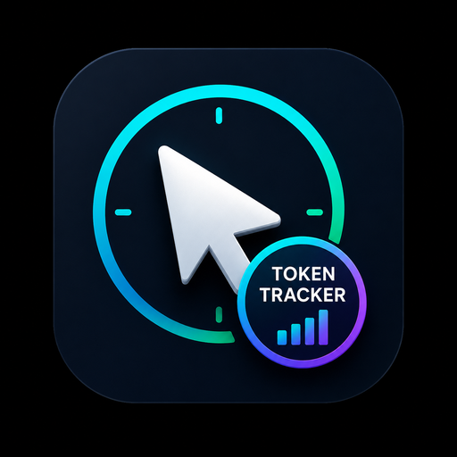

<div align="center">



# Cursor Token Tracker

**See your Cursor AI spend and token usage right in the status bar — no more opening the web dashboard.**

[](https://github.com/nguyenvinhtieng/cursor-token-tracker)
[](./LICENSE)
[](https://code.visualstudio.com/)

</div>

---

## Overview

Cursor Token Tracker is a lightweight extension for **Cursor / VS Code** that surfaces your AI usage — spend and tokens — directly on the status bar (bottom-right). It reads your session automatically from Cursor's local storage, so there's nothing to configure to get started.

```
Monthly total: $6.10/$500 (1%)  |  Today: $2.89  |  Chat: $1.42
```

## Features

| | Feature | Description |
|---|---|---|
| 📊 | **Monthly total** | Spend in the current billing cycle, shown as `$used / $budget` |
| 📅 | **Today** | Total spend for the current day |
| 💬 | **Chat session** | Live-tracked chat/agent session spend (heuristic) |
| 🛎️ | **Tooltip** | 1d / 7d / 30d totals plus recent requests on hover |
| 🧾 | **Detail panel** | Click the status bar for an events table and budget settings |
| ⚠️ | **Budget warnings** | Status bar changes color as you approach or exceed your limit |
| 🔑 | **Zero-config auth** | Reads the token from Cursor's local database automatically |

## Installation

### From a `.vsix` file

1. Download `cursor-usage-tracker-*.vsix` (from a release or a local build).
2. Open Cursor → **Extensions** → `⋯` menu → **Install from VSIX…**
3. Select the `.vsix` file and reload if prompted.

Or from the command line:

```bash
cursor --install-extension cursor-usage-tracker-0.1.0.vsix
```

### Requirements

- Signed in to Cursor IDE
- macOS: the `sqlite3` CLI on your `PATH` (usually pre-installed)

## Usage

The extension activates automatically when Cursor starts. Once running:

- **Hover** the status bar → detailed tooltip (1d / 7d / 30d + recent requests)
- **Click** the status bar → detail panel with the events table and budget settings
- A **`$(sync~spin)`** icon appears before `Chat` while a session is active

### Authentication

**No browser cookie required.** The extension reads the JWT from Cursor's local database automatically. It looks for a token in this order:

1. `~/Library/Application Support/Cursor/User/globalStorage/state.vscdb` → key `cursorAuth/accessToken`
2. macOS Keychain: `cursor-access-token` (if the `cursor-agent` CLI is installed)
3. A manual token entered via **Set Session Token**

<details>
<summary>If auto-detection fails</summary>

1. Run **Cursor Usage: Diagnose Auth** (`Cmd+Shift+P`) and check the **Output** panel.
2. Make sure you are signed in to Cursor IDE.
3. If needed, read the JWT from the database directly:

   ```bash
   sqlite3 "$HOME/Library/Application Support/Cursor/User/globalStorage/state.vscdb" \
     "SELECT value FROM ItemTable WHERE key='cursorAuth/accessToken';"
   ```

4. Paste it into **Cursor Usage: Set Session Token**.

</details>

## Commands

Open the Command Palette (`Cmd+Shift+P`) and search for **Cursor Usage**:

| Command | Description |
|---|---|
| `Cursor Usage: Refresh` | Refresh usage data immediately |
| `Cursor Usage: Show Details` | Open the detail panel |
| `Cursor Usage: Open Dashboard` | Open the detail panel |
| `Cursor Usage: Reset Chat Session` | Reset the chat session counter |
| `Cursor Usage: Diagnose Auth` | Check token auto-detection |
| `Cursor Usage: Set Session Token` | Enter a token manually |
| `Cursor Usage: Clear Saved Token` | Clear the manually saved token |

## Settings

| Setting | Default | Description |
|---|---|---|
| `cursorUsage.monthlyBudget` | `100` | Monthly budget (USD) shown on the status bar |
| `cursorUsage.showBudgetPercent` | `true` | Show budget usage percentage on the status bar |
| `cursorUsage.refreshIntervalSeconds` | `60` | Refresh interval in seconds (minimum 30) |
| `cursorUsage.activeChatRefreshSeconds` | `10` | Refresh interval while a chat is active (minimum 5) |
| `cursorUsage.autoDetectToken` | `true` | Auto-read the token from `state.vscdb` |
| `cursorUsage.showTokens` | `true` | Show token counts in the tooltip and detail panel |
| `cursorUsage.stateDbPath` | `""` | Custom path to `state.vscdb` (empty = auto-detect) |

> Budget can also be adjusted directly in the detail panel — click the status bar.

## Notes & limitations

- Uses an **unofficial API** reverse-engineered from the Cursor dashboard — it may change at any time.
- **Chat session** cost is heuristic (it tracks agent transcripts) and may not exactly match internal Composer threads.
- **Monthly usage** follows Cursor's billing cycle, not the calendar month.

## Contributing / Development

Building and packaging instructions live in **[README.dev.md](./README.dev.md)**.

## License

[MIT](./LICENSE) — Copyright © 2026 nguyenvinhtieng.vn
